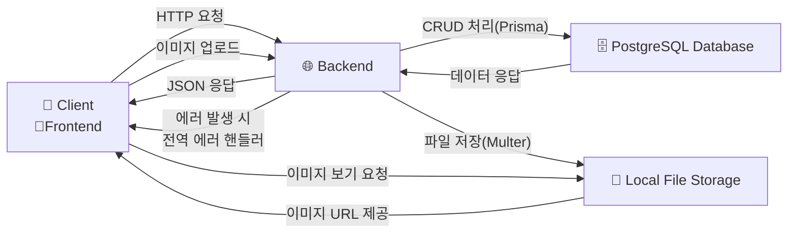
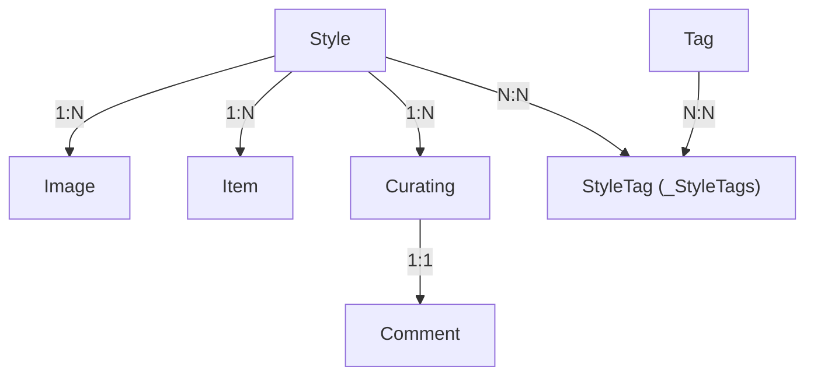
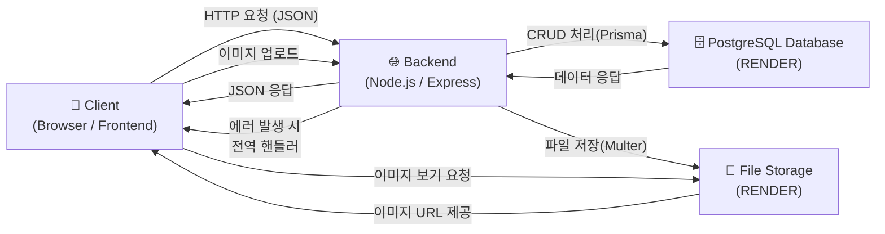
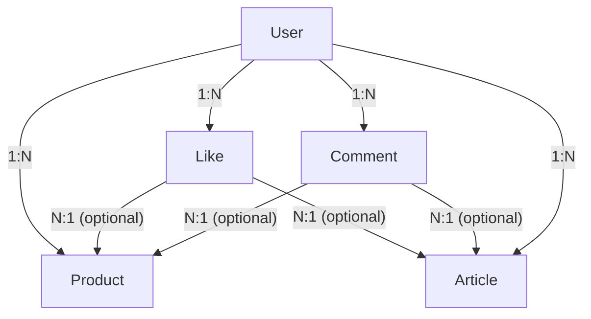

```mermaid
graph LR
    C["👤 Client
    👤Frontend"]
    S["🌐 Backend"]
    DB["🗄️ PostgreSQL Database"]
    FS["📁 Local File Storage"]

    C -->|"HTTP 요청"| S
    S -->|"CRUD 처리(Prisma)"| DB
    DB -->|"데이터 응답"| S
    S -->|"JSON 응답"| C

    C -->|"이미지 업로드"| S
    S -->|"파일 저장(Multer)"| FS
    FS -->|"이미지 URL 제공"| C

    C -->|"이미지 보기 요청"| FS
    S -->|"에러 발생 시 
    전역 에러 핸들러"| C
```

```mermaid
graph TD
    %% 노드 정의
    Style["Style"]
    Image["Image"]
    Item["Item"]
    Tag["Tag"]
    StyleTag["StyleTag (_StyleTags)"]
    Curating["Curating"]
    Comment["Comment"]

    %% 관계 정의 (라벨에 1:N, N:N, 1:1 표기)
    Style -->|"1:N"| Image
    Style -->|"1:N"| Item
    Style -->|"1:N"| Curating
    Style -->|"N:N"| StyleTag

    Tag -->|"N:N"| StyleTag

    Curating -->|"1:1"| Comment
```

```mermaid
graph LR
    Client["👤 Client
    (Browser / Frontend)"]

    Server["🌐 Backend
    (Node.js / Express)"]
    DB["🗄️ PostgreSQL Database
    (RENDER)"]
    Storage["📁 File Storage
    (RENDER)"]

    %% 일반 API 요청 흐름
    Client -->|"HTTP 요청 (JSON)"| Server
    Server -->|"CRUD 처리(Prisma)"| DB
    DB -->|"데이터 응답"| Server
    Server -->|"JSON 응답"| Client

    %% 이미지 업로드 흐름
    Client -->|"이미지 업로드"| Server
    Server -->|"파일 저장(Multer)"| Storage
    Storage -->|"이미지 URL 제공"| Client

    %% 정적 파일 제공
    Client -->|"이미지 보기 요청"| Storage

    %% 에러 처리
    Server -->|"에러 발생 시
    전역 핸들러"| Client
```

```mermaid
graph TD
    %% 노드 정의
    Article["Article"]
    Product["Product"]
    Comment["Comment"]
    User["User"]
    Like["Like"]

    %% 관계 정의 (라벨에 1:N, N:N, 1:1 표기)
    User -->|"1:N"| Product
    Like -->|"N:1 (optional)"| Article
    Like -->|"N:1 (optional)"| Product
    Comment -->|"N:1 (optional)"| Article
    Comment -->|"N:1 (optional)"| Product
    User -->|"1:N"| Article
    User -->|"1:N"| Comment
    User -->|"1:N"| Like
```

